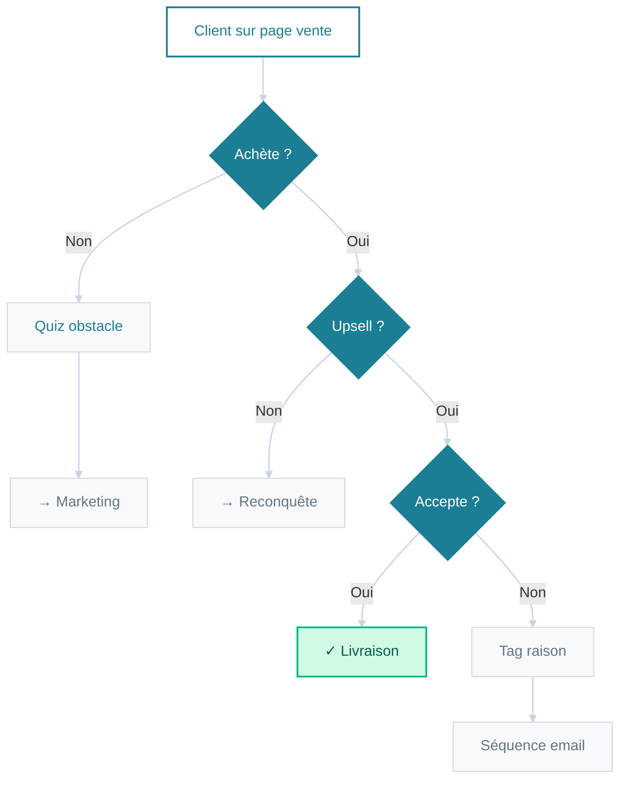
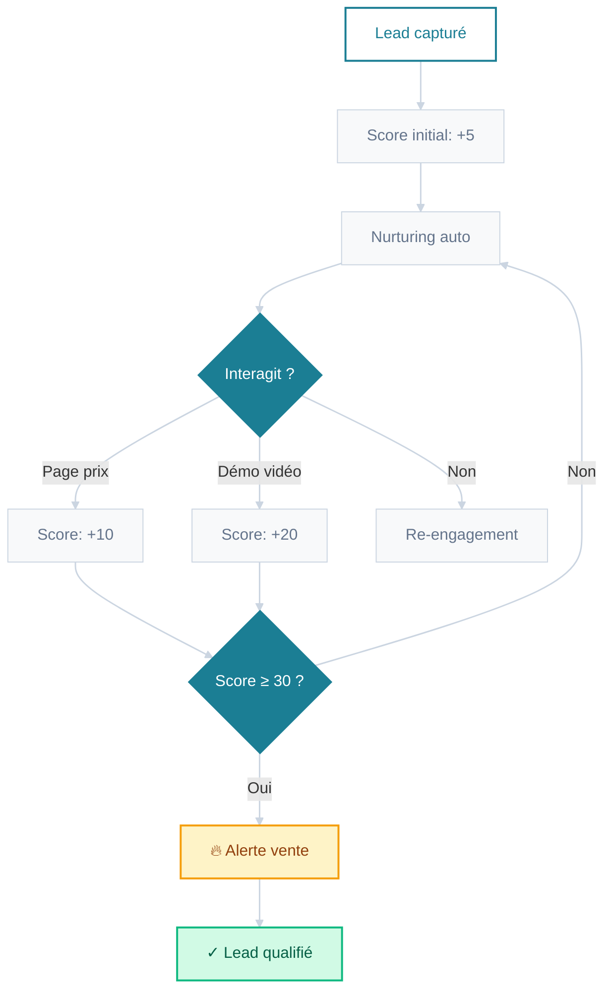
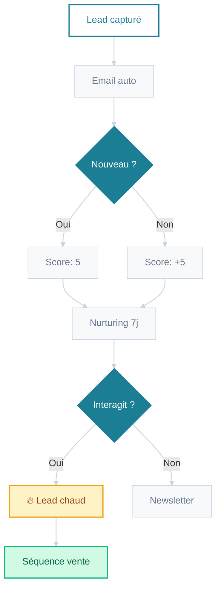
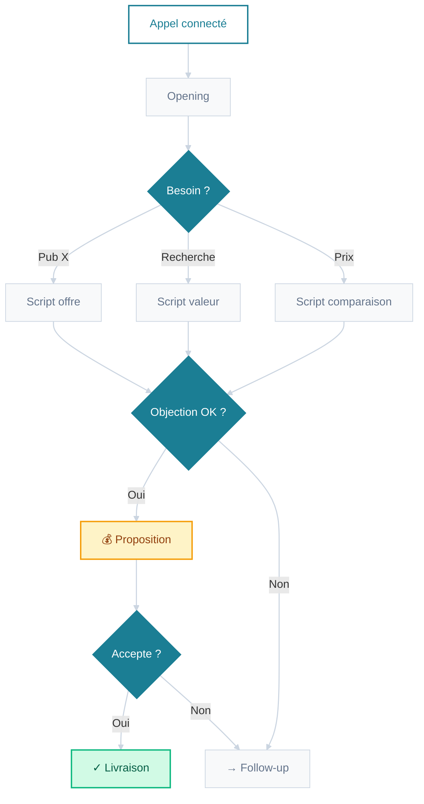
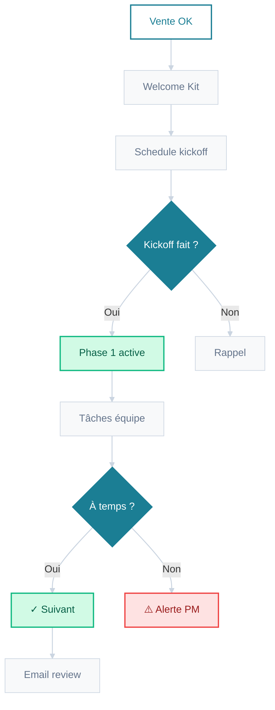
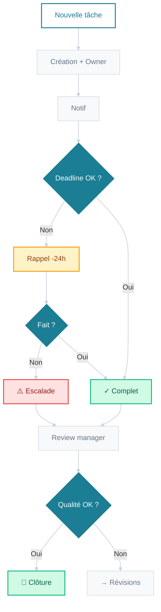
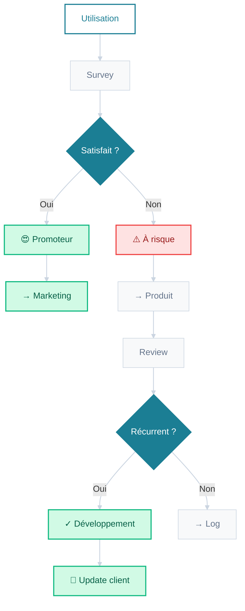
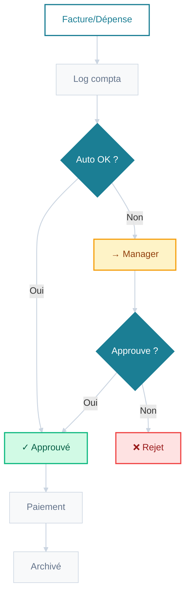

# Hormozi Playbook Notes - Transformé en système

<aside>

Les notes du playbook Hormozi :

[Le guide complet des accroches : doublez votre marketing en moins de 5 secondes](https://www.notion.so/Le-guide-complet-des-accroches-doublez-votre-marketing-en-moins-de-5-secondes-27d29e4b2d50809ca1c0d63458241047?pvs=21)

[Le guide publicitaire : Comment créer des publicités qui passent à l’échelle et convertissent](https://www.notion.so/Le-guide-publicitaire-Comment-cr-er-des-publicit-s-qui-passent-l-chelle-et-convertissent-27d29e4b2d5080b2a860c5fce1596d6a?pvs=21)

[Le guide de croissance de la machine marketing](https://www.notion.so/Le-guide-de-croissance-de-la-machine-marketing-27d29e4b2d50805db4bbcf2a42a04208?pvs=21)

[Le guide complet de croissance](https://www.notion.so/Le-guide-complet-de-croissance-27d29e4b2d508094bb76c7209ea80e6c?pvs=21)

[Le guide du closing : Transformer les peut-être en oui](https://www.notion.so/Le-guide-du-closing-Transformer-les-peut-tre-en-oui-27d29e4b2d508006b7e4d68dad534e7f?pvs=21)

[**Le guide de croissance par l’augmentation des prix**](https://www.notion.so/Le-guide-de-croissance-par-l-augmentation-des-prix-27d29e4b2d50807f9322c73c4aa42c9f?pvs=21)

[**Le guide ultime de croissance par la rétention client**](https://www.notion.so/Le-guide-ultime-de-croissance-par-la-r-tention-client-27d29e4b2d508073b2decf81a1aa9970?pvs=21)

[**Le guide ultime de croissance par génération rapide de liquidités**](https://www.notion.so/Le-guide-ultime-de-croissance-par-g-n-ration-rapide-de-liquidit-s-27d29e4b2d508078854efced2b6c0e33?pvs=21)

</aside>

[Pack 1 : Systèmes d’offres irrésistibles](https://www.notion.so/Pack-1-Syst-mes-d-offres-irr-sistibles-27d29e4b2d5080bf9223fdf74a07c23f?pvs=21)

[Pack 2 : Systèmes de génération de leads magnétiques](https://www.notion.so/Pack-2-Syst-mes-de-g-n-ration-de-leads-magn-tiques-27d29e4b2d508076a074e9ecca2a1d5e?pvs=21)

[Pack 3 : Systèmes de vente à fort taux de conversion](https://www.notion.so/Pack-3-Syst-mes-de-vente-fort-taux-de-conversion-27d29e4b2d50805090c9d84062183d00?pvs=21)

[Pack 4 : Systèmes de livraison à l’épreuve de l’échelle](https://www.notion.so/Pack-4-Syst-mes-de-livraison-l-preuve-de-l-chelle-27d29e4b2d50810fa7d0c61e30b1ce10?pvs=21)

---

## **Systèmes d'offre : Le moteur de l'offre auto-vendante**

- Ce système d'offre est **proactif et itératif**. Il ne se contente pas de traiter les demandes ; il recueille activement les données de *tous les* visiteurs (même ceux qui n'achètent pas) pour diagnostiquer en temps réel les faiblesses de votre tarification, de votre packaging et de votre proposition de valeur.
- **Les points positifs :** Il transforme votre page de vente en un laboratoire de recherche permanent. Vous passez d'une situation où vous devinez pourquoi les gens n'achètent pas à une situation où vous savez exactement pourquoi, ce qui vous permet d'ajuster et d'optimiser systématiquement votre offre pour augmenter vos taux de conversion.
- **Mise en œuvre dans les processus :**
    1. **Installation de l'outil :** Installez un outil d'enquête (comme Typeform, Qualaroo ou un simple plugin de quiz) sur vos principales pages de vente et d'achat.
    2. **Définissez la question :** Rédigez une question simple et non intrusive comme "Quelle est la première chose qui vous retient ?" avec des réponses cliquables (Prix, Pas sûr que ce soit pour moi, Besoin de plus d'informations, etc.)
    3. **Créez des automatismes :** Connectez votre outil d'enquête à votre CRM (HubSpot, ActiveCampaign) et/ou à votre plateforme d'email marketing. Établissez des règles : Si la réponse est "Prix", alors marquez le lead comme "Objection-Prix" et inscrivez-le dans la séquence d'emails "Valeur supérieure au prix".
    4. **Examiner et affiner :** Planifiez une réunion hebdomadaire pour analyser les données d'enquête et décider des modifications à tester.

---

## **Systèmes de gestion des prospects : La capture et le développement de prospects "prêts à l'emploi"**

- Ce système utilise des **données comportementales continues** pour évaluer et acheminer les prospects. C'est un moteur de maturation multi-touches et multi-canaux, pas un simple routeur à point unique.
- **Les points positifs :** Il élimine la "chasse". Au lieu que les commerciaux perdent du temps avec des prospects froids, le système réchauffe automatiquement les prospects et ne les signale pour la vente que lorsqu'ils sont vraiment chauds. Cela augmente les taux de conclusion et maximise l'efficacité de l'équipe de vente.
- **Mise en œuvre dans les processus :**
    1. **Définir la notation des prospects :** Attribuez des points aux actions clés (par exemple, +5 pour le téléchargement d'un lead magnet, +10 pour la visite de la page de tarification, +20 pour le visionnage d'une vidéo de démonstration).
    2. **Créez des séquences de maturation :** Créez trois pistes d'emails : un "Value Drip" principal pour tous les nouveaux prospects, une séquence "Hot Lead" pour ceux qui obtiennent un score élevé et une séquence "Re-engagement" pour ceux qui n'ont pas interagi.
    3. **Créez des alertes :** Configurez votre CRM pour qu'il crée automatiquement une tâche pour un commercial lorsque le score d'un prospect franchit votre seuil de "qualification" (par exemple, 30 points).
    4. **Alignement de l'équipe de vente :** Formez l'équipe commerciale à faire confiance au système de notation et à prioriser les leads signalés.

---

## **Systèmes de vente : Le flux de la conversation à la conclusion**

- Ce système de vente est un **arbre de décision dynamique** qui guide la conversation humaine. Il fournit des informations en direct et un support de script au commercial, plutôt que de le remplacer.
- **Les points positifs :** Il crée une cohérence et une prévisibilité au sein de votre équipe commerciale. Les nouveaux vendeurs ont l'assurance de vétérans et chaque objection client est traitée méthodiquement. Il permet également de constituer une base de connaissances précieuse sur les objections réelles, utilisable pour affiner le marketing et les offres.
- **Mise en œuvre dans les processus :**
    1. **Documenter les scripts :** Organisez un atelier avec votre meilleur commercial pour documenter ses réponses aux 5-10 objections et questions les plus fréquentes. Cette documentation devient votre "banque de scripts".
    2. **Créer le flux :** Transformez ces scripts en un organigramme visuel (comme celui fourni) et créez un document vivant dans un wiki[(Notion](http://notion.com)) accessible à tous les commerciaux.
    3. **Former l'équipe :** Intégrez le système dans la formation en jouant le rôle de chaque branche de l'organigramme.
    4. **Enregistrer les objections :** Demandez aux commerciaux de consigner toutes les objections non traitées à partir du chemin "Non". Analysez-les chaque semaine pour créer de nouvelles branches de script et améliorer le processus.

---

## **Systèmes de livraison : Le SOP "Scalable Fulfillment" (exécution évolutive)**

- Ce système de livraison concerne l'**automatisation des projets et des tâches**. Il gère l'ensemble du cycle de vie client après la vente, assurant une livraison qui s'adapte sans perte de qualité.
- **Les points positifs :** Il évite que l'exécution devienne chaotique et sujette aux erreurs pendant la croissance. Il crée une expérience client prévisible et fiable générant d'excellents avis et recommandations. Il protège également votre équipe de l'épuisement en automatisant les tâches administratives.
- **Mise en œuvre dans les processus :**
    1. **Choisir un outil de gestion de projet :** Optez pour un outil qui prend en charge l'automatisation[(ClickUp.com](http://ClickUp.com)).
    2. **Tracez le parcours du client :** Décomposez votre prestation en phases distinctes (par exemple, accueil, stratégie, création, révision, lancement).
    3. **Créez des modèles :** Pour chaque phase, créez un modèle dans votre outil avec les tâches, délais et responsables.
    4. **Mettre en place des déclencheurs :** Utilisez les fonctions d'automatisation pour rendre les tâches interdépendantes. Quand la "tâche A" est terminée, la "tâche B" est automatiquement assignée à la personne suivante avec une échéance.
    5. **Centraliser la communication :** Exigez que toutes les communications client liées à une tâche se fassent dans le fil de discussion de la tâche, garantissant que le contexte ne soit jamais perdu.

---

## **Systèmes de profit : Le tableau de bord de la santé**

- Ce système gère les **flux de trésorerie et la santé financière**. C'est un système de diagnostic et d'alerte précoce qui analyse automatiquement les données financières, vous faisant passer d'une comptabilité réactive à un leadership financier proactif.
- **Les points positifs :** Il vous permet de suivre en temps réel la santé réelle de votre entreprise, au-delà du simple chiffre d'affaires. Il vous alerte des problèmes (hausse des coûts, baisse de la valeur vie client) *avant qu'*ils ne deviennent des urgences, permettant des ajustements stratégiques sereinement.
- **Mise en œuvre dans les processus :**
    1. **Connecter les sources de données :** Utilisez un outil d'intégration (comme [Make.com](http://Make.com)) pour connecter vos processeurs de paiement, banques et plateformes publicitaires.
    2. **Créez le tableau de bord :** Utilisez un outil de BI (comme **Google Data Studio, Power BI, une feuille de calcul bien conçue, ou même un tableau de bord réactif construit avec [Bolt.new](http://Bolt.new) ou [Lovable.dev](http://Lovable.dev)** ) pour visualiser les indicateurs clés : **Bénéfice net, marge brute, LTV, CAC et taux de remboursement.**
    3. **Définissez des alertes :** Configurez des notifications lorsque les indicateurs franchissent vos seuils. La plupart des logiciels de comptabilité peuvent vous alerter si les dépenses d'une catégorie dépassent le budget.
    4. **Planifiez des examens financiers :** Instaurez une réunion hebdomadaire de 30 minutes pour analyser le tableau de bord et les alertes, en l'intégrant à votre routine de travail.

---

## **Système de gestion d'équipe : Délégation et flux de responsabilité**

Ce système n'est pas destiné aux clients mais constitue un processus opérationnel interne. Il remplace les affectations ad hoc et les messages Slack frénétiques par un processus structuré et transparent pour accomplir le travail.

**Les points positifs :** Il élimine la microgestion, établit des responsabilités claires et s'assure que rien n'est oublié. Il crée une culture de responsabilité et d'exécution fiable.

**La mise en œuvre :**

1. **Choisir un outil :** Utilisez un outil de gestion de projet comme [ClickUp](https://clickup.com/lp?utm_source=google&utm_medium=cpc&utm_campaign=gs_cpc_emea_nnc_brand_trial_all-devices_troas_lp_x_all-departments_x_brand&utm_content=all-countries_kw-target_text_all-industries_all-features_all-use-cases_clickup_broad&utm_term=clickup&utm_creative=651395810831_BrandChampion-03072023_rsa&utm_custom1=&utm_custom2=&utm_lptheme=&utm_lpmod=&utm_mt=b&gad_source=1&gad_campaignid=19826038949&gbraid=0AAAAACR5vIJVlGz9e7OWntYuiXW31jdt8&gclid=Cj0KCQjw5c_FBhDJARIsAIcmHK-n70_IYOk83XkyIwN6uOW4wV8yMxioui8RBWdILGS4zm5Q0Xc4SkAaAhGkEALw_wcB#gad_source_1).
2. **Établissez une règle :** Toutes les tâches doivent être créées dans l'outil, jamais simplement assignées verbalement ou par chat.
3. **Modèles de tâches :** Créez des modèles qui exigent un "responsable", un "critère clair de réussite" et une "échéance".
4. **Exploiter les automatismes :** Utilisez les automatisations intégrées pour envoyer des rappels et des alertes d'escalade.

---

## **Boucle de rétroaction du client : Moteur d'amélioration constante des produits**

Ce système dépasse les simples enquêtes de satisfaction. Il utilise la méthode éprouvée de l'"adéquation produit-marché" pour identifier systématiquement vos fans les plus passionnés et les principales lacunes de votre produit.

**Les points positifs :** Le développement produit passe d'un projet sporadique à un processus continu. Il fournit des données concrètes sur les priorités de développement et crée une relation de confiance en montrant aux clients que vous agissez réellement selon leurs retours.

**Mise en œuvre :**

1. **Mise en place de l'enquête :** Utilisez une plateforme d'automatisation d'emails (comme [Mailchimp](https://mailchimp.com/landers/email-marketing-platform/?gclsrc=aw.ds&gad_source=1&gad_campaignid=22771402313&gbraid=0AAAABAjJIRs4790JcmYzqYBMTzEHJGUJ5&gclid=Cj0KCQjw5c_FBhDJARIsAIcmHK-mIZttZ2HL8iBGYMN3jpvT9fu0zRwG6fsDVwDIR-0QlB22WJIUGqYaAs0JEALw_wcB¤cy=GBP#gad_source_1)) ou un outil dédié (comme [Delighted](https://delighted.com/) ou [Survicate](https://survicate.com/?utm_source=google&utm_medium=cpc&utm_campaign=survicate&utm_adgroup=brand&utm_term=survicatepc&camp_id=354108535&adgroup_id=21487992055&ad_id=549742337202&hsa_tgt=kwd-394055888844&hsa_grp=21487992055&hsa_src=g&hsa_net=adwords&hsa_mt=p&hsa_ver=3&hsa_ad=549742337202&hsa_acc=6519365081&hsa_kw=survicate&hsa_cam=354108535&gclid=Cj0KCQjw5c_FBhDJARIsAIcmHK_tdm3YrXjr7JhL3xPOtP-dG3x0080zmITKeA9hb-CpQQXLmmYaSFsaAuspEALw_wcB&gad_source=1&gad_campaignid=354108535&gbraid=0AAAAADko0YHlDni-YRlPAoj5CkB9XCyC-#gad_source_1)).
2. **Segmentez votre liste :** Envoyez l'enquête aux clients utilisant votre produit depuis 1-2 mois.
3. **Créez des règles d'automatisation :** Configurez votre CRM pour étiqueter les répondants selon leurs réponses.
4. **Créez un processus :** Planifiez une réunion hebdomadaire où l'équipe produit examine tous les retours collectés.

---

## **Système de contrôle financier : Le flux d'approbation des factures et des dépenses**

Ce système prévient le chaos financier en automatisant et contrôlant les sorties d'argent.

C'est un système de contrôle purement interne qui élimine le stress lié au paiement des factures et crée une piste d'audit claire pour toutes les dépenses.

**Les points positifs :** Il évite les oublis de paiement ou les doublons. Il contrôle les flux de trésorerie en exigeant une validation pour les dépenses importantes/imprévues tout en automatisant les petites dépenses récurrentes.

**Mise en œuvre :**

1. **Passez au numérique :** Utilisez un logiciel de comptabilité comme [**QuickBooks**](https://quickbooks.intuit.com/uk/oa2/?gclsrc=aw.ds&&cid=ppc_G_QB_UK_GGL_B_Quickbooks_Core_quickbooks_txt&gad_source=1&gad_campaignid=20345584763&gbraid=0AAAAAD1w8J8f9VeG6tIQAvZ_f4nVkGpth&gclid=Cj0KCQjw5c_FBhDJARIsAIcmHK-zEMrnJkKNK0BAqMUNgih8N3FqrID4cuxCJlRZLUyi5DbEJ1PqscwaArDlEALw_wcB#gad_source_1) Online ou [**Xero**](https://www.xero.com/uk/try-now/accounting/xero-accounting-software/?utm_source=GOOGLE&utm_medium=cpc&utm_campaign=UK+-+B+-+LF+-+SMB+-+Brand+-+Exact&utm_content=Xero&utm_term=xero&ds_kid=43700080348127531&gclsrc=aw.ds&gad_source=1&gad_campaignid=21398312540&gbraid=0AAAAAD0EBI06VwZGi0XLUxdhfe0QSIlmi&gclid=Cj0KCQjw5c_FBhDJARIsAIcmHK9J_2VOs3zR-dIvO5Z83hNWR959HOxKx9UfpnMtV-aXyyVLTBFP6zYaAhWJEALw_wcB#gad_source_1).
2. **Établissez des règles :** Définissez ce qu'est une "petite dépense récurrente" pour votre entreprise (par exemple, tout abonnement inférieur à 100 dollars par mois).
3. **Utilisez des outils :** Connectez votre flux bancaire et utilisez les fonctions de paiement de factures du logiciel.
4. **Établir une politique :** Communiquez clairement le processus d'approbation à tous les membres de l'équipe qui peuvent engager des dépenses.

