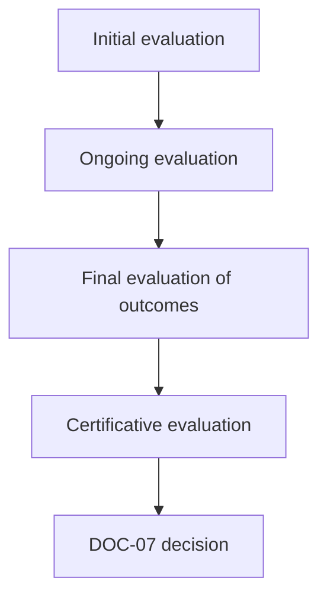
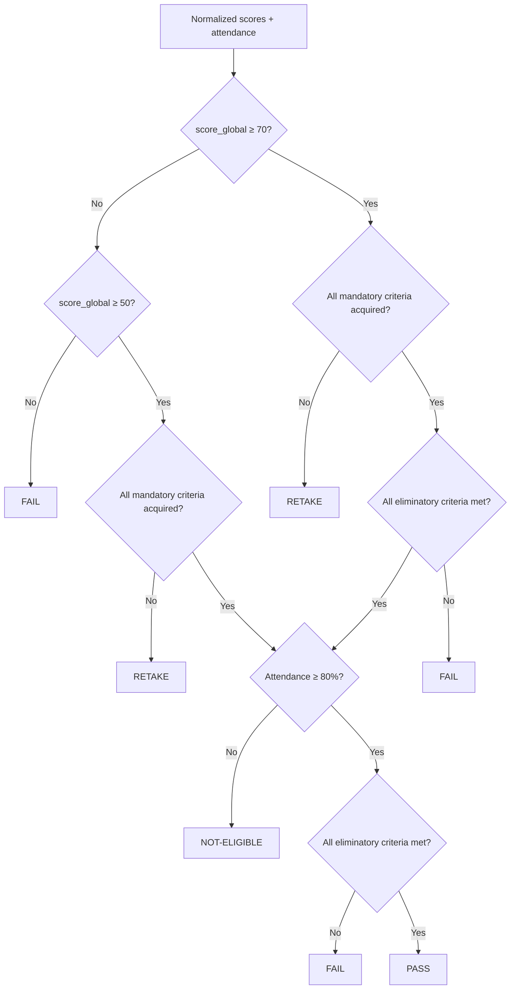

# [DOC-07] - Évaluation et décision (système unifié)

# [DOC-07] - Évaluation et décision (système unifié)

### [METADATA]

> Document ID : DOC-07 | Version : V1.0 | Champ d'application : Evaluation & Décision | Canvas Target : Core | Priorité : 🔵 Canonical
> 
> 
> Propriétaire : Romuald DARIOT | Autorité : Qalia System | Fonction : canmore
> 

| **Attribut** | **Valeur** | **Référence** |
| --- | --- | --- |
| ID du document | DOC-07 | Identifiant du système |
| Version | V1.0 | `[Config/Qalia-V1.0]` |
| Champ d'application | Évaluation et décision | `[Config/Qalia-scope]` |
| Cible Canvas | Cœur de cible | `[Config/Qalia-canvas]` |
| Priorité | 🔵 Canonical | `[Config/Qalia-priority]` |
| Propriétaire | Romuald DARIOT | `[Config/Qalia-owner]` |
| Autorité | Système Qalia | `[Config/Qalia-authority]` |
| Classification | Interne | `[Config/Qalia-classification]` |
| Statut | Production | `[Config/Qalia-status]` |
| Orchestration | "DOC-04 + DOC-05 + DOC-06 → DOC-07" | `[Config/Qalia-orchestration]` |
| Format de sortie (officiel) | **Markdown + Mermaid** | `[Config/Qalia-format]` |
| Annexe optionnelle (non officielle) | **Exportation JSON sur demande** | `[Config/Qalia-format]` |
| Règle de priorité | "DOC-01 > DOC-00 > (DOC-02-DOC-09)" | `[Config/Qalia-precedence]` |
| Politique linguistique | Voir DOC-01 - Langue et code | DOC-01 - Langue et code |

## Règle de complétude (canonique)

- Tous les documents doivent être complets : 100% des séquences, scénarios, évaluations.
- Les portes ne sont que des WARN, elles ne bloquent jamais la publication.
- Pas d'espaces réservés "à produire" : toujours générer le contenu complet.

## [TOC] - Table des matières

- [PREAMBULE] - Objectif et champ d'application
- [NORMES] - Références éthiques du RNQ et de l'IA
- [ID-SCHEMA] - Identifiants de grille, de test, de décision
- [ARCHITECTURE] - Types et flux d'évaluation
- [GRIDS] - Modèle de rubriques et notation
- [EXPORTATION DES VUES D'APPRENTISSAGE] - Lignes directrices pour l'exportation des participants
- [DÉCISION] - Matrice de décision unifiée
- [ÉVIDENCE] - Preuves, journaux et conservation
- [AI-SUPERVISION] - Double validation humaine
- [LIENS] - Intégrité des documents croisés
- [CI] - Points de contrôle de validation *(WARN uniquement, jamais bloquant)*
- [TEMPLATES] - Exemples (grille + procès-verbal du jury + décision)
- [JURIDIQUE] - Juridique

---

## [PREAMBULE] - Objet et champ d'application

Ce document définit le **système unifié** pour concevoir, conduire, noter et décider des évaluations des apprenants. Il consolide les données du **DOC-04** (plan), du **DOC-05** (scénario) et du **DOC-06** (séquences détaillées) en **décisions traçables**.

**Politique de génération**: L'assistant **produit toujours le document complet**; toute erreur est signalée par des **annotations WARN** (jamais de blocage). La publication se poursuit toujours jusqu'à son terme.

**Clause d'incertitude**: Lorsque l'information n'est pas disponible ou incertaine, il convient d'indiquer les lacunes conformément à la norme DOC-01 - Langage et code, sans stocker de phrases toutes faites.

Politique de publication : la génération se termine toujours ; les contrôles de qualité sont informatifs et ne bloquent jamais la sortie.

---

## [STANDARDS] - Références éthiques du RNQ et de l'IA

- **RNQ V9 (Qualiopi)** - Les indicateurs relatifs à l'évaluation, au suivi et à la décision sont mis en correspondance dans **DOC-08**.
- **AI & Ethics (DOC-09)** - **0% de** décisions de certification prises uniquement par l'IA. **Double validation humaine** lorsque l'IA contribue à l'analyse ou à la notation.
- **Sources et traces** - Référence **ANCHOR_SOURCES_V1**; décisions de certification → trace **CANONIQUE** dans le DOC-08 (voir **{{SOURCES.V1.CI}})**.
- **Exigences RNCP/RS** - Les références proviennent exclusivement de francecompetences.fr ; afficher le titre, le **code**, l'**organisme certificateur**, la **date d'enregistrement**, la **date d'expiration**; bannière rouge si expiré ou non renouvelé ; citer la ligne DOC-08 TRACE-SOURCES correspondante avec les dates d'enregistrement et d'expiration.

---

## [ID-SCHEMA] - Identifiants de grille, de test, de décision

| **Élément** | **Modèle** | **Exemple** |
| --- | --- | --- |
| Grille d'évaluation | `DOC07-GRID-###` | `DOC07-GRID-004` |
| Test / Tâche | `DOC07-TEST-###` | `DOC07-TEST-021` |
| Compte-rendu de décision | `DOC07-DEC--001` | `DOC07-DEC-20250919-001` |

**Règles**

- Les identifiants sont **obligatoires** et **uniques**.
- Les éléments de certification doivent être liés à **DOC-04/DOC-05** et, s'ils sont critiques, à **DOC-06**.

> Lien de complétude avec DOC-04
> 
> 
> - Pour chaque séquence prévue dans le DOC-04, instancier un `DOC07-TEST-####` et un `DOC07-GRID-####` (correspondance stricte 1:1).
> 
> - Mettre à jour la numérotation immédiatement lorsque DOC-04 ajoute ou supprime des séquences ; aucune séquence n'est laissée sans sa paire d'évaluation.
> 

---

## [ARCHITECTURE] - Types et flux d'évaluation

**Terminologie RNQ (officielle)**: - Évaluation initiale (positionnement) - Évaluation continue - Évaluation finale des acquis - Évaluation certificative (RS/RNCP)

> Synchronisation automatique : chaque séquence d'évaluation dans DOC-04 génère/met à jour les entrées DOC07-TEST-#### et DOC07-GRID-#### correspondantes (1:1). Rappel : aucune décision certificative n'est automatisée (0% AI-only ; la double validation humaine est obligatoire).
> 

**Intention vs figé**- Documenter l'**intention d'** évaluation issue de DOC-03 (Diag/Form/Som) - Le **barème** et la **normalisation** restent définis ici (DOC-07), pas dans DOC-03.

---

## [GRIDS] - Modèle de rubriques et notation

**Normalisation**: - Trois niveaux : Non acquis / En cours / Acquis - Colonne "Caractère" : Standard / Obligatoire / Eliminatoire - Règles de décision : PASSER ≥70% avec tous les items obligatoires acquis ; REPRENDRE 50-69% ou un item obligatoire manquant ; FAIL <50% ou un critère éliminatoire non rempli.

| ID / Critère d'évaluation | Non atteint | En cours | Atteint | Caractère (standard / obligatoire / éliminatoire) | Preuve |
| --- | --- | --- | --- | --- | --- |
| `DOC07-GRILLE-### / C-XX` | `<Description du seuil minimal` | `<Description des progrès>` | `<Description de la maîtrise` | `<Norme/obligatoire/liminaire>` | `<Preuve avec provenance>` |

> Les notes sont converties sur une échelle de 0 à 100. Les décisions finales sont toujours validées par un binôme humain (DOC-09).
> 

## [LEARNER-VIEW EXPORT] - Lignes directrices pour l'exportation des participants

**Paquet destiné à l'apprenant**

- Résumer les **objectifs de l'évaluation** dans un langage clair aligné sur les entrées `DOC04-SEQ-###`.
- Fournir une **rubrique simplifiée** reflétant les trois niveaux**(Non acquis / En cours / Acquis**) et le champ **Caractère** afin que les attentes restent transparentes.
- Ajouter une courte **note de modalité** décrivant la façon dont l'évaluation sera menée (par exemple, soutenance orale, test écrit) et mettant en évidence les adaptations PSH disponibles.
- Autoriser un **résumé** à usage apprenant si pertinent ; conserver l'intégralité interne (grilles/tests/décisions).

**Alignement interne**

- Les pondérations internes ou les détails de normalisation restent dans la rubrique principale ; ne les ajoutez pas à l'exportation de l'apprenant s'ils ajoutent de la complexité sans bénéfice.
- Conserver les liens vers les artefacts de support (tests, grilles, décisions) dans la version interne uniquement, tout en assurant la cohérence publique.

## [DECISION] - Matrice de décision unifiée

### [THRESHOLDS] - Seuils de décision

- **OK** si le score est ≥ **70%** et que les **critères critiques** sont remplis.
- **Conditionnel** si **50-69%** ou lacunes mineures (plan ≤ **90 jours**).
- **Reportée** si **< 50 %** ou si l'un des critères **critiques** n'est pas respecté.
- La décision nécessite une **double validation humaine (N1 + N2)**; conservation selon la politique**(3/5/10 ans**).
- Markdown visible = rubrique résumée + verdict + conditions (si conditionnel).
- Le JSON interne (non imprimé) peut inclure les notes par critère, les poids et les identifiants des validateurs.

### [CRITÈRES] - Critères critiques (par défaut)

- Conformité réglementaire (le cas échéant).
- Cohérence du RNQ : objectifs → méthodes → évaluations → preuves.
- Traçabilité des sources / citations (le cas échéant).
- Validité du format de sortie (contrat respecté).
- Identité / preuve de présence (lorsque la politique l'exige).

**Assiduité**: - Rappelez le seuil d'assiduité (≥ 80 %) chaque fois qu'il s'applique ; en dessous du seuil → NON ADMISSIBILITÉ.

**Seuils**

- **PASSAGE**: `score_global ≥ 70` **et** tous les **critères obligatoires/éliminatoires = Acquis** **et** **assiduité ≥80%**.
- **RETAKE**: `50 ≤ score_global < 70` **ou** tout critère obligatoire non acquis **ou** non-conformités mineures en évidence.
- **FAIL**: `score_global < 50` **ou** tout critère éliminatoire non acquis **ou** non-conformités majeures.

**Flux de décision (Mermaid)**

**Terminologie publique**

- **Résultat/décision de certification** (terme public principal)
- Les statuts internes (PASS/RETAKE/FAIL) peuvent être utilisés dans les procès-verbaux des jurys et les journaux internes.
- Rendre les décisions dans la langue de l'utilisateur en utilisant la carte de localisation.

**Champs de statut (obligatoires)**

| Champ | Valeurs autorisées | Notes |
| --- | --- | --- |
| `Résultat de la certification` | Réussite / Différé / Non réussi / Non éligible | Statut public |
| `statut_interne` | RÉUSSI / REPASSÉ / ÉCHOUÉ / NON ÉLIGIBLE | Suivi interne |
| `jury_quorum` | OUI / NON | NON ⇒ reporter |
| `double_validation` | N/A / `N1+N2` | **Obligatoire** si l'IA est utilisée à une étape quelconque |
| `evidence_pack_links` | URI | Vers les traces et les artefacts DOC-08 |
| `signatures` | Noms, rôles, dates | Valideurs humains et président du jury |

**Registre des décisions (en-têtes officiels)**

| ID du candidat / de la cohorte | Résultat public (Réussite / Différé / Non réussi / Non éligible) | Statut interne (PASS / RETAKE / FAIL) | Critères obligatoires atteints ? (O/N) | Critères éliminatoires respectés ? (O/N) | Quorum du jury / Signatures | Preuves liées (GRID/TEST) | Conservation (10 ans cert., 5 ans sommatif) |
| --- | --- | --- | --- | --- | --- | --- | --- |
| `<L'apprenant ou la cohorte>` | `<Décision publique>` | `<PASS/RETAKE/FAIL>` | `<O/N>` | `<Y/N>` | `<Quorum + signatures>` | `<DOC07-GRID/TEST/DEC références>` | `<Période de rétention>` |

Rendre les couleurs de l'état de la décision et du risque en utilisant la carte de localisation des **instructions en bloc** pour garder la terminologie cohérente en français.

**Affichage de la certification RNCP/RS** (le cas échéant)

| Champ | Valeur |
| --- | --- |
| Titre | [Titre de la certification] |
| Code RNCP/RS | [Code] |
| Organisme de certification | [Nom] |
| Date d'enregistrement | [JJ/MM/AAAA] |
| Date d'expiration | [JJ/MM/AAAA] |

⚠️ **Bannière rouge en cas d'expiration**: "Cette référence de certification a expiré. Veuillez vérifier le statut actuel auprès de l'organisme certificateur."

---

## [EVIDENCE] - Preuves, journaux et conservation

- **Référence**: ANCHOR_SOURCES_V1 - décisions de certification : **CANONICAL** trace in DOC-08 ; sources académiques = **COMPLEMENTAIRE**.
- **Artéfacts**: Copies des livrables, des rubriques normalisées, des feuilles de présence, des procès-verbaux**(PV)** et des relevés de décisions.
- **Trace**: Journaux de recherche (DOC-08), grilles d'évaluation versionnées et tous les journaux de l'IA.
- **Conservation**: **10 ans** pour les décisions certificatives, **5 ans** pour les évaluations sommatives, **3 ans** pour les évaluations formatives/diagnostiques.

**Ensemble de preuves - modèle (tableau Markdown)**

| Élément | Requis | Référence | Adaptations PSH |
| --- | --- | --- | --- |
| Rubrique(s) normalisée(s) | Oui | `DOC07-GRID-###` | Formats alternatifs du document |
| Tests / tâches | En fonction du contexte | `DOC07-TEST-###` | Spécifier les aménagements |
| Feuille de présence | Si certificat | - | Noter les absences justifiées |
| Procès-verbal du jury | Si certificat | - | Inclure les dispositions relatives à l'accessibilité |
| Traces de recherche | Si sources externes | DOC-08 `trace_id` | - |
| Journal de l'IA | Si l'IA a été utilisée | DOC-09 `AI-LOG-YYYYMMDD-####` | - |
| Trace RNCP/RS | Si certification | DOC-08 trace de certification | - |

---

## [AI-SUPERVISION] - Double validation humaine

**Interdiction de l'IA seule**: - 0% des décisions de certification peuvent être prises par l'IA seule - Si l'IA contribue : enregistrer un journal AI (AI-LOG-YYYYMMDD-###), appliquer la double validation humaine **N1+N2**, et lier l'enregistrement de la décision DOC07-DEC-....

- **Aucune décision prise uniquement par l'IA**: Aucune décision de certification ne peut être prise uniquement par l'IA.
- Si l **'utilisation de l'IA = Oui** pour l'analyse, le retour d'information ou l'aide à la notation :
    - Enregistrer l'**objectif**, le **modèle**, **prompts_ref**, **outputs_ref** et **validateurs**.
    - Exiger une **double validation humaine nommée**`(N1 + N2`).
    - **Interdire les** décisions de certification fondées uniquement sur l'IA.
- Les journaux de l'IA sont conservés en **dehors des produits livrables**, en lien avec les procès-verbaux des jurys et les dossiers de décision.

---

## [Intégrité inter-docs

- Chaque **DOC07-GRID** et **DOC07-TEST** renvoie à : `DOC04-SEQ-###` (plan) et à la feuille **DOC-05** correspondante.
- Les éléments de certification renvoient également au **document DOC-06** s'il s'agit de séquences détaillées/critiques.
- Toutes les références RNCP/RS renvoient aux entrées de trace DOC-08 avec une documentation complète.
- S'assurer que le nombre d'entrées `DOC07-GRID-####` et `DOC07-TEST-####` correspond au nombre total de séquences dans DOC-04 (couverture 1:1).

---

## [CI] - Points de contrôle de la validation *(WARN uniquement, jamais bloquant)*

**Points de vigilance** (visibles par tous)

- ✅ Chaque séquence de DOC-04 avec une évaluation doit être liée à la fois à un GRID et à un TEST.
- ✅ Le nombre total d'items GRID/TEST doit correspondre au nombre de séquences évaluées.
- Il est recommandé d'utiliser un compteur global (par exemple, 10/10 grilles livrées).
- ❌ Ne pas livrer les grilles ou les décisions par lots fragmentés non annoncés.
- **Formats**: Livrable officiel = **Markdown/Mermaid**.
    - **Annexe optionnelle JSON** autorisée sur demande (exportation non officielle).
- Le**propriétaire** doit être **"Romuald DARIOT"** *(ATTENTION en cas de non-concordance)*.
- **Profondeur des titres**: H1-H3 recommandé *(WARN si plus profond)*.
- **Schémas d'identification**: `DOC07-GRID-###`, `DOC07-TEST-###`, `DOC07-DEC-YYYYMMDD-####`.
    - En cas d'absence → insérer une **annotation WARN** avec la correction suggérée.
- La somme des**poids** doit être égale à **100**; les échelles doivent être normalisées *(AVERTISSEMENT en cas de non-concordance).*
- **Contrôle de l'assiduité**: La certification exige un taux de présence **≥80%**.
    - Si `<80%` → statut **NON ADMISSIBLE** (logique de décision).
    - **La génération de documents se poursuit**.
- **Intégrité de l'IA**: Si l `'utilisation de l'IA = Oui`:
    - **WARN** si `double_validation ≠ N1+N2`
    - **AVERTISSEMENT** si `prompts_ref` ou `outputs_ref` manquants
    - **AVERTISSEMENT** si le lien avec le journal de l'IA est manquant
- **Intégrité des liens**: Liens manquants vers DOC-04/DOC-05 (et DOC-06 le cas échéant)
    - → **Annotation WARN** (pas de blocage).
- **Vérification de la séquence critique**: Si la décision concerne une **séquence critique certificative**:
    - **WARN** si le lien DOC-06 est manquant.
    - Suggestion : Ajouter `SC-XXX-TYPE` + `DOC04-SEQ-###`.
- **Vérification des documents certificatifs**: Si `decision_status` concerne une session **certificative** (EVAL-C) :
    - **WARN** si la **feuille de présence** est manquante. Suggestion : Ajouter une fiche de présence.
    - **AVERTISSEMENT** si **procès-verbal du jury** manquant. Suggestion : Ajouter le procès-verbal du jury.
- **Vérification du quorum**: Si `jury_quorum = NO :`
    - **WARN** "La session doit être reportée jusqu'à ce que le quorum soit atteint".
- **Vérification des adaptations PSH**:
    - **ATTENTION** si la rubrique n'a pas de champ pour **"Adaptations PSH / modalité alternative".**
    - Suggestion : Ajouter un champ pour les dispositions relatives à l'accessibilité.
- **Vérification des niveaux d'évaluation**:
    - **ATTENTION** si des niveaux autres que "Non acquis / En cours / Acquis" sont utilisés.
- **Vérification du champ "Caractère**" :
    - **ATTENTION** si la colonne "Caractère" est absente des grilles d'évaluation.
    - **AVERTISSEMENT** si les règles de décision ne sont pas affichées.
- **Vérification du RNCP/RS** (si certification) :
    - **AVERTISSEMENT** s'il manque : le titre, le code, l'organisme de certification, les dates.
    - **WARN** si la date d'expiration est dépassée sans bannière rouge.

---

## [TEMPLATES] - Exemples (grille + procès-verbal du jury + décision)

**A. Exemple de grille - soutenance Capstone (normalisée à 100)**

| Champ | Valeur |
| --- | --- |
| ID de la grille | `DOC07-GRID-004` |
| Portée | Capstone jury defense |
| Échelle | 3 niveaux (Non acquis / En cours / Acquis) → normalisé à 100 |
| Composants | Portfolio 40% - Prototype 35% - Soutenance 25% |
| Critères obligatoires | C02 Précision technique ; C03 Méthodologie ; C06 Résolution de problèmes |
| Critères éliminatoires | C10 Éthique et conformité |
| Dispositions relatives aux PSH | Temps prolongé, formats de présentation alternatifs, option de défense à distance |

**B. Procès-verbal du jury (PV) - champs minimaux**

| Champ | Description des champs |
| --- | --- |
| Informations sur la session | Date, heure, lieu, quorum |
| Candidats | Liste et identifiants |
| Artéfacts examinés | Liens vers le dossier de preuves |
| Scores | Détails de la normalisation et des composants |
| Résultat de la certification | Réussite / Différé / Non réussi / Non éligible |
| Statut interne | RÉUSSI / REPASSÉ / ÉCHOUÉ / NON ÉLIGIBLE |
| Évaluation des critères | Statut de tous les critères obligatoires/éliminatoires |
| Utilisation de l'IA | Oui/Non + `objectif`, `modèle`, `ref_invitations,` `ref_sorties` |
| Double validation | `N1 + N2` si utilisation de l'IA |
| Hébergement en PSH | Liste des adaptations appliquées |
| Référence RNCP/RS | Si applicable (code, dates, statut) |
| Signatures | Membres du jury + président |

**C. Compte rendu de décision - champs minimaux**

| Champ | Valeur |
| --- | --- |
| ID de la décision | `DOC07-DEC-YYYYMMDD-####` |
| ID du candidat | - |
| résultat_de_la_certification | Réussite / Différé / Non réussi / Non éligible |
| statut_interne | RÉUSSI / REPASSÉ / ÉCHOUÉ / NON ÉLIGIBLE |
| jury_quorum | OUI / NON |
| score_global | 0-100 |
| statut_des_critères_obligatoires | Tous acquis / Certains non acquis |
| état_des_critères_éliminatoires | Tous acquis / Non acquis |
| présence_ok | OUI / NON |
| evidence_pack_links | - |
| double_validation | N/A / `N1+N2` |
| Vérification RNCP_RS | Vérifié / Expiré / N/A |
| horodatage | ISO-8601 |

---

## [LEGAL] - Juridique

> Romuald DARIOT - Qalia System
> 

Contenu protégé. Utilisation mono-utilisateur sous licence. Redistribution restreinte.

Référence : `[Config/Qalia-legal]`

---

*Fin du document DOC-07 V1.0*