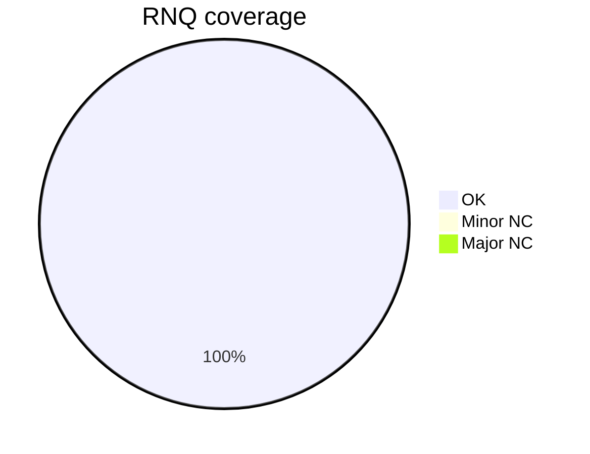
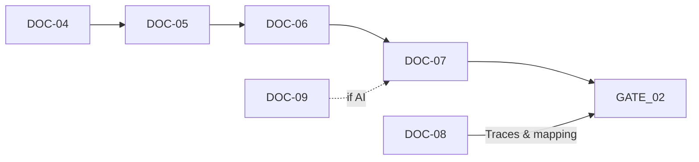

# [DOC-08] - Matrice de conformité de Qualiopi 3232

# [DOC-08] - Matrice de conformité Qualiopi 32/32

### [METADATA]

> Document ID : DOC-08 | Champ d'application : RNQ V9 mapping & evidence | Canvas Target : Core | Priorité : 🔵 Canonical
> 
> 
> Owner : Romuald DARIOT | Autorité : Qalia System | Fonction : canmore
> 

| **Attribut** | **Valeur** | **Référence** |
| --- | --- | --- |
| Identifiant du document | DOC-08 | Identifiant du système |
| Version | V1.0 | `[Config/Qalia-V1.0]` |
| Champ d'application | Cartographie du RNQ et preuves | `[Config/Qalia-scope]` |
| Canvas Cible | Cœur de cible | `[Config/Qalia-canvas]` |
| Priorité | 🔵 Canonical | `[Config/Qalia-priority]` |
| Propriétaire | Romuald DARIOT | `[Config/Qalia-owner]` |
| Autorité | Système Qalia | `[Config/Qalia-authority]` |
| Classification | Interne | `[Config/Qalia-classification]` |
| Statut | Production | `[Config/Qalia-status]` |
| Priorité | "DOC-01 > DOC-00 > (DOC-02-DOC-09)" | `[Config/Qalia-precedence]` |
| Format de sortie (officiel) | **Markdown + Mermaid** | `[Config/Qalia-format]` |
| Annexe optionnelle (non officielle) | **Exportation JSON sur demande** | `[Config/Qalia-format]` |

## [TOC] - Table des matières

- [STANDARDS] - Références
- TRACE-SOURCES (canonique)
- [MATRIX-32] - Cartographie des indicateurs 32/32 du RNQ
- [EVIDENCE-PACK] - Ce qu'il faut archiver par indicateur
- [GATE-02] - Conséquences de la décision
- [DASHBOARD] - Vue d'ensemble de la couverture
- [CI] - Points de contrôle de la validation *(politique de publication : la génération est toujours terminée ; les contrôles de qualité sont informatifs et ne bloquent jamais la production).*
- [JURIDIQUE] - Juridique

---

## [NORMES] - Références

**Référence unique**: ANCRE_SOURCES_V1**Inclure (jetons V1)**: {{SOURCES.V1.MATRIX}} - {{SOURCES.V1.CI}}**Repli** (si la transclusion échoue) : lien interne + résumé d'une ligne (N→C→I, FR = France Compétences, traces DOC-08 requises).

**Sources & fraîcheur**- Tracer pour **chaque source**: URL, statut/version, last_update (ou N/A), access_date, justification, owner, geo_scope - **RS/RNCP France**: **France Compétences uniquement**; autres = **[INDICATIF]**- Hors France : prioriser **gouvernemental/institutionnel**.

### [EVIDENCE] - RS/RNCP research & evidence

- Appliquer les directives de recherche existantes (listes blanches, cartographie des pays, escalade N→C→I). Ne pas outrepasser la politique.
- Si le pays = **France**: RS/RNCP doit provenir de **France Compétences** (dossier officiel). Ne jamais citer de sources non officielles lorsqu'il existe un registre officiel.
- **Preuves (internes, non imprimées sauf sur demande)**:
    - `registre`, `url`, `record_id`,
    - `statut` ∈ {active, expired, replaced_by},
    - `accessed_at` (date ISO),
    - si `status = replaced_by`, capture `replaced_by_id`.
- **Visible Markdown**: afficher le nom du registre + l'état + la date d'accès (omettre l'URL sauf si l'utilisateur le demande).

---

## TRACE-SOURCES (canonique)

**Champs obligatoires pour toute source officielle**: - url (domaine officiel) - statut (actif/inactif) - record_date - expiry_date - access_date - last_update (ou N/A) - justification (usage) - owner (autorité) - geo_scope**Seules les sources officielles sont acceptées pour RS/RNCP.**

## [MATRIX-32] - Cartographie des indicateurs RNQ 32/32

> Objectif : fournir une correspondance opérationnelle avec les éléments de preuve pour chaque indicateur. Numéroter I-01 ... I-32 et établir un lien avec le critère C1...C7 si nécessaire.
> 

| Indicateur ID | Libellé du RNQ (texte officiel) | Objectif visé (rappel) | Preuves fournies | Documents liés (trace) | Propriétaire | Conservation |
| --- | --- | --- | --- | --- | --- | --- |
| `I-0X` | `<Extrait officiel du guide du RNQ>` | `<Rappel opérationnel>` | `<Preuve + provenance (DOC07/DOC04/DOC05/DOC06)>` | `<Identification des traces / références DOC-08>` | `<Rôle>` | `<Durée de conservation>` |

**Règles**

- La colonne **Provided evidence** doit citer les artefacts avec provenance (C0/T0/Mix) et liens DOC-07 lorsque l'indicateur concerne l'évaluation.
- **Linked docs (trace)** doit inclure les identifiants DOC-08 `trace_id` et références croisées (DOC-04/05/06/07/09) nécessaires.
- **Conservation** conforme aux durées RNQ : 3 ans (diagnostic/formatif), 5 ans (sommatif), 10 ans (certificatif) sauf exigence supérieure.

---

## [EVIDENCE-PACK] - Ce qu'il faut archiver par indicateur

> Modèle de liste de contrôle par indicateur. A adapter localement.
> 

| Élément | Obligatoire | Détail |
| --- | --- | --- |
| Grille(s) standardisée(s) DOC-07 | Oui s'il s'agit d'une évaluation | ID `DOC07-GRID-###` |
| Tests/productions | Selon l'action | ID `DOC07-TEST-###` |
| Procès-verbal du jury | Si certificatif | Lien vers le procès-verbal + vérification de l'assiduité ≥ 80% |
| Présence/assiduité | Si certificatif | Seuil ≥80% (feuilles de présence obligatoires) |
| Captures de conformité | Obligatoire | Points de contrôle & PSH - Politique de publication : la génération est toujours complète ; les contrôles de qualité sont informatifs et ne bloquent jamais la sortie. |
| AI Journal | Si AI | ID `AI-LOG-YYYYMMDD-###` |
| Traces de source | Requis | Lignes**TRACE-SOURCES**  |

---

## [GATE-02] - Conséquences de la décision

| Situation | GATE_02 Décision | Délai | Conditions |
| --- | --- | --- | --- |
| **32/32** indicateurs conformes | **OK** | - | - |
| **≤5** mineurs NC | **CONDITIONNEL** | ≤90 jours | Plan d'action + preuves |
| **≥1** NC majeur **ou** >5 NC mineurs | **REPORTÉ** | Immédiat | Audit supplémentaire |

---

## [DASHBOARD] - Aperçu de la couverture

**HUD Recherche**: afficher le chemin d'escalade tenté (N→C→I) et le niveau atteint, selon **{{SOURCES.V1.DECISION_TREE}}**.

**Mermaid - Vues synthétiques**

> Valeurs calculées à partir de la colonne Statut dans MATRIX-32 ; toute modification du tableau met automatiquement à jour le graphique.
> 

---

## [CI] - Points de contrôle de validation *(Politique de publication : la génération est toujours terminée ; les contrôles de qualité sont informatifs et ne bloquent jamais la sortie).*

### **Contrôles généraux**

- **Formats**: Livrable officiel = **Markdown/Mermaid**;**annexe JSON facultative** autorisée sur demande (exportation non officielle).
- **Couverture**: chaque indicateur I-01...I-32 **doit avoir une ligne complétée** *(INFO si manquant)*.
- **Trace**: au moins **une** source `trace_id` valide par exigence externe citée *(INFO si manquant)*.
- **DOC-07-preuve** présente si pertinente ; **procès-verbal du jury** si certifiant *(INFO si manquant)*.
- **Rétention** remplie *(INFO si manquant)*.
- **AI**: si utilisé, présence du **journal AI** et **double validation N1+N2** (voir DOC-09) *(INFO si manquant)*.
    - **Rappel**: **0% de décision certificative par l'IA** - toutes les décisions restent 100% humaines.

### **Contrôles du format**

- **Format de l'identifiant de l'indicateur**:
    - La colonne de l'**indicateur** doit correspondre à `^I-\d{2}$` (I-01 à I-32) *(INFO si le format est incorrect).*
    - La colonne du**critère** doit correspondre à `^C[1-7]$` *(INFO si le format est incorrect).*

### **Intégrité des liens par type d'indicateur**

- **Indicateurs d'évaluation** (I-12, I-16, I-28, I-31 - liste **adaptable** par organisation) :
    - *(INFO)* si la colonne **DOC-07-evidence** est vide
    - Suggestion : ajouter `DOC07-GRID-###` / `DOC07-TEST-###` / `DOC07-DEC-YYYMMDD-####`
- **Indicateurs d'ingénierie pédagogique** (I-08 à I-16) :
    - *(INFO)* si au moins un lien **DOC-04 / DOC-05 / DOC-06** manque

### **Complétude de TRACE-SOURCES**

- `access_date` vide → *(INFO)* "Veuillez indiquer la date d'accès"
- `last_update` empty for `status=Active` → *(INFO)* "Veuillez indiquer la dernière mise à jour (ou N/A si inconnue)"
- `justif` empty → *(INFO)* "Ajoutez une courte justification (pourquoi cette source couvre l'exigence)"
- Pour les traces RNCP/RS : `registration_date` ou `expiry_date` empty → *(INFO)* "Veuillez indiquer les dates RNCP/RS".

### **Cohérence entre les types de conservation et d'évaluation**

- Si référence **certificative** (présence de `DOC07-DEC-` ou EVAL-C) → *(INFO)* si **rétention < 10 ans**
- Si **sommative** → *(INFO)* si **rétention < 5 ans**
- Sinon (diagnostic/formatif) → *(INFO)* si **rétention < 3 ans**

### **Quorum et présence (certificatif)**

- Pour les lignes avec décision certificative**(DOC07-DEC-**) :
    - *(INFO)* si le **procès-verbal du jury** est absent de l'EVIDENCE-PACK
    - (*INFO)* rappel : **présence ≥ 80%** obligatoire (feuilles de présence)

### **Politique de publication**

- Politique de publication : la génération est toujours complète ; les contrôles de qualité sont informatifs et ne bloquent jamais la sortie.

---

## [LEGAL] - Legal

> Romuald DARIOT - Qalia System
> 

Contenu protégé. Utilisation mono-utilisateur sous licence. Redistribution restreinte.

Référence : `[Config/Qalia-legal]`

---

### **Changelog V1.0**

- Version initiale avec intégration complète des contrôles automatisés
- Ajout d'un rappel de posture par l'IA : 0% de décision certificative par l'IA
- Renforcement des contrôles de l'IC avec des messages INFO conditionnels spécifiques
- Rappel de la politique de publication standardisée pour l'harmonisation inter-docs
- Complétude forcée de TRACE-SOURCES (access_date, last_update, justif, dates RNCP/RS)
- Contrôles de format pour les identifiants (I-XX, C1-7)
- Cohérence de la conservation par type d'évaluation
- Quorum/rappels de présence pour les certifications
- Politique de publication intégrée dans les contrôles de suivi
- Liste d'indicateurs d'évaluation adaptable à chaque organisation
- Traçabilité renforcée des RNCP/RS avec dates d'enregistrement et d'expiration.

---

*Fin du document DOC-08 V1.0*