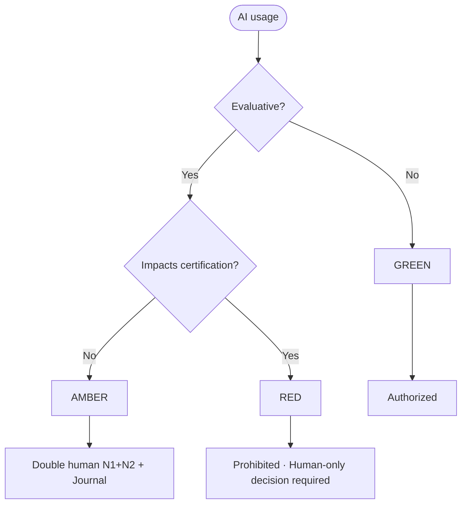
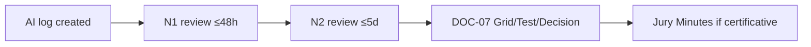

# [DOC-09] - Cadre de référence en matière d'IA et d'éthique

# [DOC-09] - Cadre de l'IA et de l'éthique

### [METADATA]

> Document ID : DOC-09 | Version : QALIA-2025-09-V1.0 | Portée : AI usage & Ethics | Canvas Target : Core | Priorité : 🔵 Canonical
> 
> 
> Propriétaire : Romuald DARIOT | Autorité : Qalia System | Fonction : canmore
> 

| **Attribut** | **Valeur** | **Référence** |
| --- | --- | --- |
| ID du document | DOC-09 | Identifiant du système |
| Version | V1.0 | `[Config/Qalia-V1.0]` |
| Champ d'application | Utilisation de l'IA et éthique | `[Config/Qalia-scope]` |
| Cible Canvas | Cœur de cible | `[Config/Qalia-canvas]` |
| Priorité | 🔵 Canonical | `[Config/Qalia-priority]` |
| Propriétaire | Romuald DARIOT | `[Config/Qalia-owner]` |
| Autorité | Système Qalia | `[Config/Qalia-authority]` |
| Classification | Interne | `[Config/Qalia-classification]` |
| Statut | Production | `[Config/Qalia-status]` |
| Priorité | "DOC-01 > DOC-00 > (DOC-02-DOC-09)" | `[Config/Qalia-precedence]` |
| Format de sortie (officiel) | **Markdown + Mermaid** | `[Config/Qalia-format]` |
| Annexe optionnelle (non officielle) | **Exportation JSON sur demande** | `[Config/Qalia-format]` |

## [TOC] - Table des matières

- [PRINCIPES] - Règles canoniques
- [MODELE DE RISQUE] - Tricolore VERT/AMBRE/ROUGE
- [SUPERVISION] - Double validation humaine N1/N2
- [JOURNAUX] - Modèles de journaux AI (Markdown)
- [ACCESS] - Matrice d'accès par artefact
- [SANCTIONS] - Échelle d'escalade
- [LIENS] - Exigences transversales (DOC-04/05/06/07/08)
- [CI] - Points de contrôle de validation *(WARN uniquement, jamais bloquant)*
- [SÉCURITÉ] - Protection et minimisation des données
- [MESSAGES STANDARD] - Modèles de réponse de l'assistant
- [JURIDIQUE] - Juridique

---

## [PRINCIPES] - Règles canoniques

**Éthique IA - Non intrusif, neutre**: - 0 % de décision certificative par IA seule - Si IA contribue à l'analyse/scorage : rappel d'une double revue humaine (N1+N2) - signal informatif (WARN-only).

## [MODELE DE RISQUE] - Tricolore VERT/AMBRE/ROUGE

**Flux (sirène)**



| **Couleur** | **Description de l'état** | **Exemples** | **Conditions** | **Statut** |
| --- | --- | --- | --- | --- |
| **VERT** | Assistance non évaluative, faible impact | Reformulations, listes de contrôle, modèles, idéation | Mentionner l'utilisation, examen simple | **Autorisé** |
| **AMBRE** | Assistance évaluative**indirecte**  | Proposition d'éléments de grilles d'évaluation, synthèse d'entretiens, retour d'information substantiel | **Double validation N1/N2** et revue AI requise | **Autorisé sous contrôle** |
| **ROUGE** | Décision d'**évaluation/certification** automatisée | Notation finale, décision PASS/FAIL, jury automatisé | Interdit. Utiliser un processus humain et documenter | **Interdit** |

> Règle : Toute tâche d'évaluation requiert un niveau AMBER minimum. Tout ce qui touche à la certification est ROUGE.
> 

---

## [SUPERVISION] - N1/N2 double validation humaine

**Flux de travail (Mermaid)**



**Définitions**

- **N1**: examinateur principal.
- **N2**: Examinateur indépendant qualifié.

**Délais cibles**

- **N1**: ≤ **48 heures** après la production de l'artefact AI.
- **N2**: ≤ **5 jours** après N1.

**Procédure**

1. Documenter l'utilisation de l'IA (voir §[JOURNAUX]).
2. N1 examine le contenu/la forme, signe.
3. N2 vérifie de manière indépendante, signe.
4. Signaler N1+N2 dans **DOC-07** (grille/test/décision) et lier le **procès-verbal du jury** s'il est certificatif.

---

## [JOURNAUX] - Modèles de journaux AI (Markdown)

**Champs obligatoires supplémentaires**: - `risk_color` (GREEN/AMBER/RED). Si ROUGE → décision strictement humaine (utilisation de l'IA bloquée pour la décision).

**A. Journal de l'IA - modèle minimal**

| Champ | Valeur | Format |
| --- | --- | --- |
| `log_id` | `AI-LOG-YYYYMMDD-###` | Modèle : `^AI-LOG-\d{8}-\d{3}$` |
| `date` | AAAA-MM-JJ | ISO 8601 |
| `propriétaire` | Nom, rôle | Texte |
| `objet` | Ex : synthèse des entretiens ; suggestions de critères | Texte |
| `couleur_du_risque` | VERT / ORANGE / ROUGE | Enum |
| `modèle` | Nom du modèle | Texte |
| `modèle_version` | Version spécifique du modèle | Texte |
| `params` | Température, top-p, semence, etc. | JSON |
| `outils_utilisés` | Ex : whisper-asr, ocr, code-interpreter, web-retrieval (RAG) | Liste des outils utilisés |
| `prompts_ref` | Lien vers le bloc d'invites (MD) | URL |
| `outputs_ref` | Lien vers la sortie (MD) | URL |
| `data_sources` | Sources utilisées (DOC-08 si externe) | Liste des sources |
| `personal_data` | Oui/Non + justification | Booléen + Texte |
| `base_légale` | Consentement/contrat/intérêt légitime | Enum |
| `note_minimisation_des_données` | Ce qui a été supprimé/masqué | Texte |
| `politique de conservation` | 3 ans non-certifié / 10 ans certifié | Texte |
| `N1_validation` | Nom, date | Texte |
| `N2_validation` | Nom, date | Texte |
| `lien_décision` | Lien vers `DOC-07-DEC-`. `..` ou Procès-verbal du jury | URL |

> Note sur la conservation : la conservation suit DOC-07/DOC-08 (3/5/10 ans par type).
> 

**B. Bloc d'invite - exemple (Markdown)**

```markdown
# Prompt[Describe the prompt and context in clear text]# Output (summary)[Text summary of output, link to complete artifact]
```

---

## [ACCESS] - Matrice d'accès par artefact

| **Artéfact** | **Lire** | **Ecrire** | **Conservation** |
| --- | --- | --- | --- |
| Journal AI | Equipe pédagogique, Qualité/RNQ | Propriétaire + Qualité | 3 ans (non certifié) / 10 ans (certifié) |
| Procès-verbal du jury | Jury, Qualité/RNQ, Direction | Jury | 10 ans |
| DOC-07 Grilles | Equipe pédagogique, Jury | Pédagogie | 5-10 ans par type |
| DOC-08 Preuves | Qualité/RNQ, Auditeurs | Qualité | Par RNQ |

---

## [SANCTIONS] - Échelle d'escalade

| **Niveau** | **Type de sanction** | **Conséquence** | **Action** |
| --- | --- | --- | --- |
| 1 | Non mention de l'utilisation de l'IA (VERT) | Rappel | Mise à jour du journal |
| 2 | Absence de N2 sur AMBRE | Avertissement | Validation rétroactive + coaching |
| 3 | ROUGE Utilisation de l'IA | **Invalide** | Réévaluation humaine à 100 % + procès-verbal |
| 4 | Données à caractère personnel injustifiées | Incident | Notification au DPD + mesures correctives |

---

## [LINKS] - Exigences transversales (DOC-04/05/06/07/08)

**Référence**: ANCHOR_SOURCES_V1 - lorsque l'IA effectue des recherches, imposer une utilisation **CANONIQUE** (voir **{{SOURCES.V1.POLICY}})** et tracer à travers **{{SOURCES.V1.CI}}**.

---

## [CI] - Points de contrôle de validation *(WARN uniquement, jamais bloquant)*

**Contrôle IA**: - Détecter l'usage d'IA en évaluation → journal IA + N1+N2 attendus (WARN si manquants) - Gabarits génériques uniquement (aucun exemple métier injecté).

## [SÉCURITÉ] - Protection et minimisation des données

- Éviter les données personnelles inutiles dans les invites/sorties.
- Anonymiser les ensembles de données d'exemple et les transcriptions avant l'utilisation de l'IA.
- Stocker les journaux de l'IA **séparément** des livrables des candidats.
- **Interdire la formation/la mise au point** sur les artefacts ou les données personnelles des candidats.
- **Interdiction absolue** d'envoyer des secrets/API/accréditations dans les invites.
- En cas de traitement ou de transfert à haut risque en dehors de l'UE/EEE → **DPIA** et clauses contractuelles types (CCN) requis. *(AVERTISSEMENT en cas d'absence)*.

---

## [MESSAGES STANDARD] - Modèles de réponse de l'assistant

> Note : Ces messages sont des modèles d'assistants qui ne sont pas inclus dans les livrables destinés aux candidats/jury.
> 

**Engagement & ton**- Clarté, sobriété, direct ; **version complète systématique**- Résumé autorisé si pertinent, distinct du livrable (à la demande ou pour orientation interne).

### **ROUGE détecté**

> "risk_color=RED → 100% de décision humaine requise. Je peux préparer des éléments de délibération, mais je n'automatiserai pas la décision."
> 

### **IA en certificatif sans N1+N2**

> "IA détectée sur évaluation certificative → N1+N2 obligatoire + AI-LOG requis. Mise en place d'un WARN et suspension de la consolidation jusqu'à ce que ces éléments soient fournis."
> 

### **Données personnelles**

> "Données personnelles détectées → application de la minimisation/anonymisation et documentation de la base juridique dans le journal AI."
> 

### **Incertitude**

> Voir DOC-01 - Langage et code (le moteur d'exécution gère automatiquement la formulation).
> 

---

## [LEGAL] - Juridique

> Romuald DARIOT - Qalia System
> 

Contenu protégé. Utilisation mono-utilisateur sous licence. Redistribution restreinte.

Référence : `[Config/Qalia-legal]`

---

*Fin du document DOC-09 V1.0*